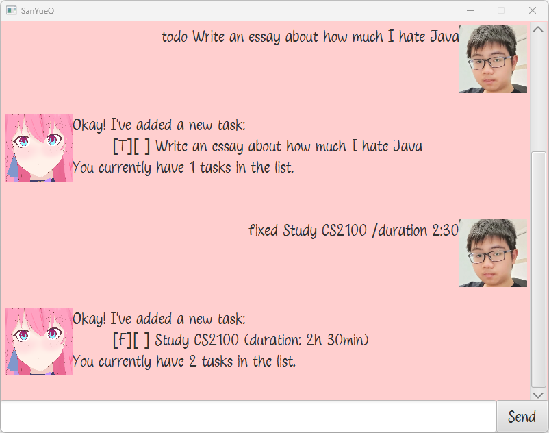

# SanYueQi



> “Are you here to play with me?”

This is a simple chatbot written in Java that can be used for daily task management.

For the eagle-eyed among you, yes, this project is themed around [*March 7th*](https://hsr.hoyoverse.com/en-us/character?utm_source=hsrofficialweb&utm_medium=fab&utm_campaign=button&worldIndex=3&charIndex=3), one of the main heroines of *Honkai: Star Rail*. She's here to play because ~~your mental health after CS3230~~ the *Astral Express* broke down.

## What March can help you manage
- Todos
- Deadlines
- Events
- Fixed-duration tasks
- Completed tasks
- Formatted dates
- Protection from *Silver Wolf*'s hacks (coming soon™)

## Features

- [x] Management of various task types
- [X] Date and time parsing
- [x] Flexible symbols, because nobody likes bugs caused by delimiters. You can use pretty much any symbol you like in your task description.

## Setup
1. Ensure Java 17 or later is installed on the system, otherwise the Astral Express will not let you board.
2. Download the .jar file from Release v0.2.
3. Move the .jar file to any directory you would like March 7th to call home.
4. Open a terminal in that directory.
5. Run `java -jar SanYueQi.jar`.
6. March will welcome you with a warm smile, and the Astral Express will hand you a notebook, `logbook.csv` and an identity, `user.png`.

## Usage
1. On subsequent runs of `java -jar SanYueQi.jar`, the existing `logbook.csv` and `user.png` (or `user.jpg`) will be loaded if they exist. Otherwise, they will be created automatically.
2. Refer to the sample commands below for how to use the chatbot.
3. All successful commands automatically write to `logbook.csv` where applicable.
4. To close the chatbot, type `bye` as the command or simply close the window. Either way, your tasks are automatically saved.

## New identity?
Simply replace the default `user.png` with any image of your choice. Ensure it is named `user.jpg` or `user.png`. It is highly recommended that you use a square image.

## Main commands

1. Add a task using `todo`, `deadline`, `event` or `fixed`.
2. View tasks using `list`.
3. Mark a task using `mark` or `unmark`.
4. Delete tasks using `delete`.
5. Search for tasks using `find`.

## Sample commands
**1. Add a new Todo**
```
todo Bank my Stellar Jade
```

Expected output:
```
Okay! I've added a new task:
    [T][ ] Bank my Stellar Jade
You currently have 1 tasks in the list.
```
---
**2. Add a new Deadline**
```
deadline Visit Penacony /by 2026-12-31
```

Expected output:
```
Okay! I've added a new task:
    [D][ ] Visit Penacony (by: 31-Dec-2026)
You currently have 2 tasks in the list.
```
---
**3. Mark a task as done**
```
mark 2
```

Expected output:
```
Great job on completing this task!
    [D][X] Visit Penacony (by: 31-Dec-2026)
```
---
**4. List all tasks**
```
list
```

Expected output:
```
Here are the tasks in your list:
1. [T][ ] Bank my Stellar Jade
2. [D][X] Visit Penacony (by: 31-Dec-2026)
```
---
**5. Add a new Event**
```
event Cooking * Show | The Herta's \ Magic / Kitchen | Please, "RSVP" by the 'deadline'. /from 2026-09-10 /to whenever I'm done baking a cake
```

Expected output:
```
Okay! I've added a new task:
    [E][ ] Cooking * Show | The Herta's \ Magic / Kitchen | Please, "RSVP" by the 'deadline'. (from: 10-Sept-2026 to: whenever I'm done baking a cake)
You currently have 3 tasks in the list.
```
---
**6. Delete a task**
```
delete 1
```

Expected output:
```
Okay, I've deleted this task:
    [T][ ] Bank my Stellar Jade
You currently have 2 tasks in the list.
```
---
**7. Mark a task as not done yet**
```
unmark 1
```

Expected output:
```
Okay, I've marked this task as not done yet:
    [D][ ] Visit Penacony (by: 31-Dec-2026)
```
---
**8. Add a new Fixed-Duration Task**
```
fixed fixed Fixed $!1V3r W0|_f 《银狼》 h@X'|)　　　HSRを遊んでいます　　　\_/R 5paCE s+/\TioN /to \\ /to /by /from #from /duration/duration /duration -420:-69
```

Expected output:
```
Okay! I've added a new task:
    [F][ ] fixed Fixed $!1V3r W0|_f 《银狼》 h@X'|) HSRを遊んでいます \_/R 5paCE s+/\TioN /to \\ /to /by /from #from /duration/duration (duration: -422h 51min)
You currently have 3 tasks in the list.
```
---
**9. Find tasks**
```
find Penacony
```

Expected output:
```
Here are the matching tasks in your list:
1. [D][ ] Visit Penacony (by: 31-Dec-2026)
```

## Credit

[@LazeyLazed](https://x.com/LazeyLazed) for the illustration of March 7th used in the chatbot

[Ahmad Ihsan](https://www.dafont.com/profile.php?user=1228713) for the Felleria font used in the chatbot


